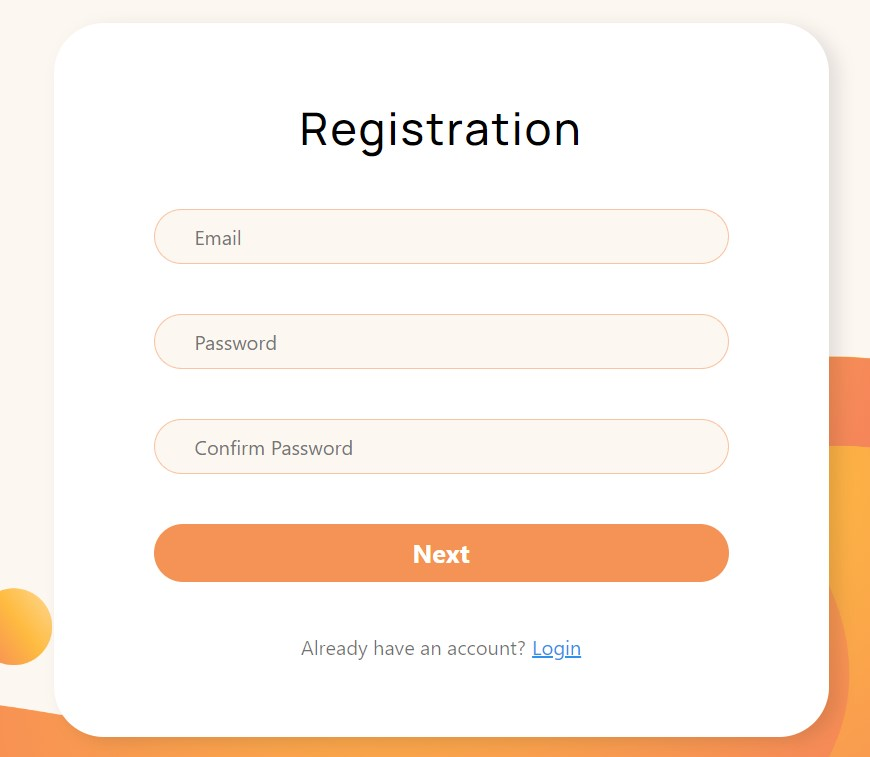

<div align="center">
  <a href="https://gradussus.github.io/petly-front/" name="readme-top">
        
  </a>

  <h1 align="center">Pet App</h1>
  </div>


## About The Project
The development team **Future developers** has created a project that helps people and animals. Each person will be able to find their favorite pet in the categories "in good hands", "found, lost" and "sale". Also, registered users can make announcements, helping other animals find their owners.


## Built With

 <a href="https://github.com/gradussus/petly-api">
         
Node
</a>

 <a href="https://react.dev">
         
React
</a>

 <a href="https://redux.js.org/">
         
Redux
</a>

 <a href="https://www.npmjs.com/package/redux-persist">
         
Persist
</a>

 <a href="https://formik.org/">
         
Formik
</a>

 <a href="https://www.npmjs.com/package/axios">
         
Axios
</a>

<p align="right">(<a href="#readme-top">back to top</a>)
(<a href="https://gradussus.github.io/petly-front">try now</a>)</p>


## Getting Started

### Installation

1. Clone the repo
   ```sh
   git clone https://github.com/gradussus/petly-front.git
   ```

2. Install NPM packages
   ```sh
   npm install
   ```

3. Start the project
   ```sh
   npm start
   ```

<p align="right">(<a href="#readme-top">back to top</a>)
(<a href="https://gradussus.github.io/petly-front">try now</a>)</p>


## Usage

* Find your pet

 

* Register

 

* Add new pet

 


<p align="right">(<a href="#readme-top">back to top</a>)
(<a href="https://gradussus.github.io/petly-front">try now</a>)</p>


## Contributing

Contributions are what make the open source community such an amazing place to learn, inspire, and create. Any contributions you make are **greatly appreciated**.

If you have a suggestion that would make this better, please fork the repo and create a pull request.

<p align="right">(<a href="#readme-top">back to top</a>)
(<a href="https://gradussus.github.io/petly-front">try now</a>)</p>

## Contact Us

Project Link: [https://gradussus.github.io/petly-front](https://gradussus.github.io/petly-front/)

Project Link(BackEnd): [https://github.com/gradussus/petly-api](https://github.com/gradussus/petly-api/)

Team lead - [LinkedIn](https://www.linkedin.com/in/vitalii-shevchenko/?lipi=urn%3Ali%3Apage%3Ad_flagship3_people_connections%3BTPk4eDRRTgW6YwMAAD2%2BSg%3D%3D)

Second team lead - [LinkedIn](https://www.linkedin.com/in/ivan-blazhko/?lipi=urn%3Ali%3Apage%3Ad_flagship3_people_connections%3BTPk4eDRRTgW6YwMAAD2%2BSg%3D%3D)

Developer - [LinkedIn](https://www.linkedin.com/in/nataliia-yukhnenko/?lipi=urn%3Ali%3Apage%3Ad_flagship3_people_connections%3BTPk4eDRRTgW6YwMAAD2%2BSg%3D%3D)

Developer - [LinkedIn](https://www.linkedin.com/in/olena-kryvtsova-16259957/?lipi=urn%3Ali%3Apage%3Ad_flagship3_people_connections%3BTPk4eDRRTgW6YwMAAD2%2BSg%3D%3D)


<p align="right">(<a href="#readme-top">back to top</a>)
(<a href="https://gradussus.github.io/petly-front">try now</a>)</p>


